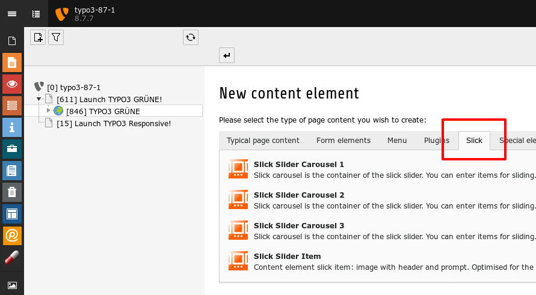
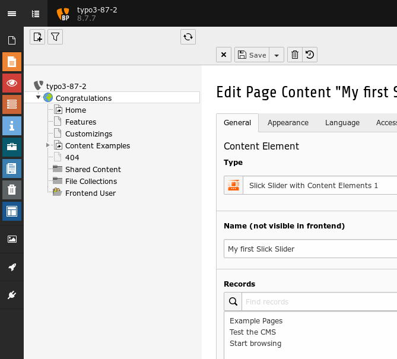
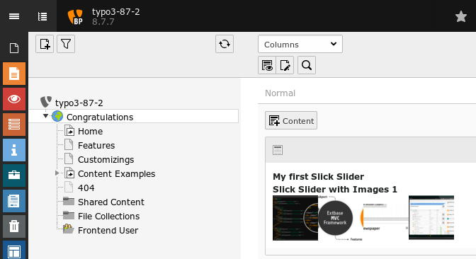

.. ==================================================
.. FOR YOUR INFORMATION
.. --------------------------------------------------
.. -*- coding: utf-8 -*- with BOM.

.. include:: ../../../Includes.txt

.. _introduction-screenshots-backend:

Backend
=======

New Content Element Wizard
--------------------------

	New Content Element Wizard with Slick

You can use up to six sliders on one page: 3 sliders with content elements and three with images.

TYPO3 6.x/7.x: Slick Sliders with images aren't available.

Slick Slider with Content Elements
----------------------------------

	Slick Slider with Content Elements

If you are using the Slick Slider with Content Elements, you can add every content element to the slider like 
headers, texts, images, sitemaps and html code among others.

Slick Slider with Images
------------------------

	Slick Slider with Images

If you are using the Slick Slider with Images, you can add every image to the slider.
