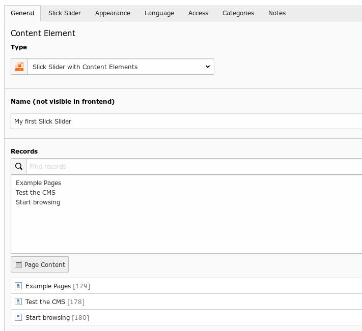

.. ==================================================
.. FOR YOUR INFORMATION
.. --------------------------------------------------
.. -*- coding: utf-8 -*- with BOM.

.. include:: ../../../Includes.txt

.. _introduction-screenshots-backend:

Backend
=======

New Content Element Wizard
--------------------------

.. figure:: ../../../Images/Backend/slick-backend_content-wizard.jpg
	:width: 1000px
	:alt: New Content Element Wizard with Slick

	New Content Element Wizard with Slick

Slick provides three content elements:

* the slick slider with content elements (from TYPO3 8.7)

* the slick slider with images (from TYPO3 8.7)

* and the slich slider item

You can use other slick slider content elements from former TYPO3 versions, 
but they aren't needed any longer and they are marked as deprecated.

Slick Slider with Content Elements
----------------------------------

	Slick Slider with Content Elements

If you are using the Slick Slider with Content Elements, you can add every content element to the slider like 
headers, texts, images, sitemaps and html code among others.

.. figure:: ../../../Images/Backend/slick-backend_content_plugin_usual-adjustments.jpg
	:width: 600px
	:alt: Slick Slider with the usual adjustments

	Slick Slider with the usual adjustments

There are a lot properties for adjustment:

* Usual adjustments

* Smartphone

* Tablet

* Desktop

* Wide screen

* and so called Rare adjustments 

Slick Slider with Images
------------------------

	Slick Slider with Images

If you are using the Slick Slider with Images, you can add every image to the slider.

**Table of Contents**

.. toctree::
    :maxdepth: 2
    :titlesonly:

    01_TYPO3_76/Index

